# ATSAMR34_ECC608A_ACTILITY
> Develop with the SAM R34 LoRa SiP and Microchip LoRaWAN stack on Actility join servers

This guide will direct you through the process of getting started with developing a secure LoRa end device product using Microchip Technology's Pre-provisioned ATECC608A secure element along with Actility Join server.

1. [Material required](#step1)
2. [Software](#step2)
3. [Hardware setup](#step3)
4. [Sample Application Code](#step4)
5. [Actility ThingPark Activation](#step5)
6. [Running the demo](#step6)

## Material required 

Purchase samples of the <a href="https://www.microchipdirect.com/product/search/all/ATECC08A-TNGACT" target="_blank">ATECC608A-TNGACT</a>
secure element 
and the <a href="https://www.microchipdirect.com/product/search/all/AT88CKSCKTUDFN-XPRO" target="_blank">CryptoAuthentication UDFN Socket Kit</a>
 
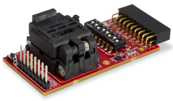
 

Purchase the <a href="https://www.microchip.com/Developmenttools/ProductDetails/DM320111" target="_blank">SAM R34 Xplained Pro Evaluation Kit</a>
 
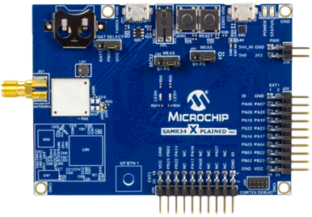
 

Purchase a LoRa(r) Gateway from <a href="https://market.thingpark.com/gateways.html?ship_to=all" target="_blank">ThingPark Market</a>
 

 

## Software 

- Download and install Atmel Studio 7.0 IDE.  
https://www.microchip.com/mplab/avr-support/atmel-studio-7

- Open Atmel Studio 7.0 IDE.  
- Then, you need Advanced Software Framework (ASFv3) v3.47.0 release or upper release.  
Install ASFv3 as an extension to Atmel Studio from the menu: Tools -> Extensions and Updates …
- Once the installation is complete, you must restart Atmel Studio.  
- Download and install a serial terminal program like Tera Term.  
https://osdn.net/projects/ttssh2/releases/

Note: ASFv3 is an MCU software library providing a large collection of embedded software for AVR® and SAM flash MCUs and Wireless devices. ASFv3 is configured by the ASF Wizard in Atmel Studio 7.0 (installed as an extension to Studio). ASFv3 is also available as a standalone (.zip) with the same content as Studio extension (https://www.microchip.com/mplab/avr-support/advanced-software-framework).

Important:
Until the next Atmel Studio IDE release, you have to manually install the Device Part Pack for developing with SAMR34/R35 on Atmel Studio 7.0 IDE.
(all products released in between IDE releases of Atmel Studio should be manually added by user to develop applications).
- Go to Tools -> Device Pack Manager  
- Check for Updates  
- Search for SAMR34 and click install  
- Repeat the same for SAMR35  
- Restart Atmel Studio 7.0 IDE  

## Hardware setup 

Configure the DIP switch of the CryptoAuthenticationUDFN Socket kit for I2C communication with the host microcontroller.
**1, 3 and 7 must be placed to ON position**
 
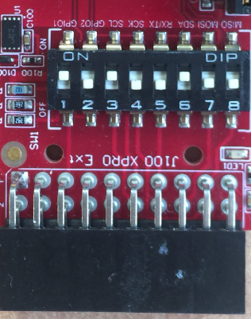
 

- Open the socket board
 
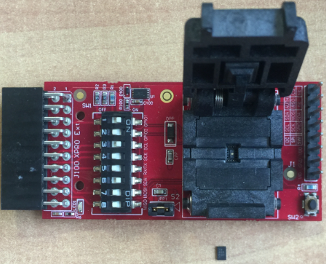
 

- Make sure the ATECC608A device is ready to be inserted in the right direction.
Make sure the pin 1 of the component (represented by a point) is located at the bottom left.
 
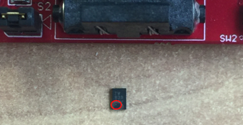
 

- Place the Secure Element in the UDFN socket
 
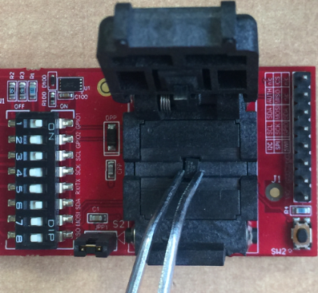
 

- Make sure the Secure Element is properly seated and the pin 1 is located at the bottom left.
 
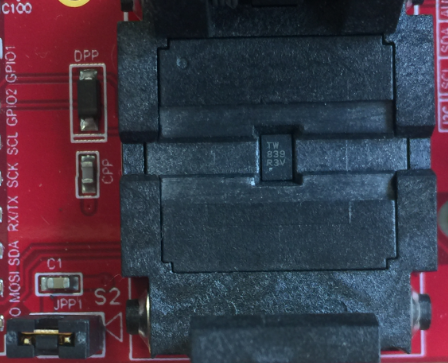
 
- Close the clam shell lid.
 

- Attach the CryptoAuthenticationUDFN Socket kit to the SAM R34 Xplained Pro board on the **EXT3 header.**
 
Plug the antenna.
Attach a USB cable to SAM R34 Xplained Pro board's EDBG micro-B port on the right. 
The USB ports powers the board and enables the user to communicate with the kits.
 
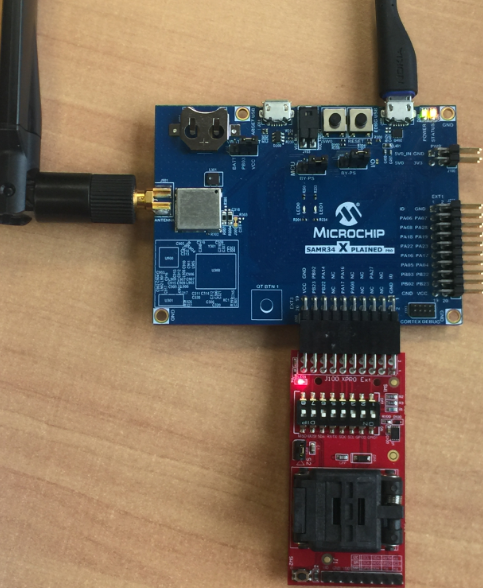

- Wait for USB driver installation and COM ports mounting.  
- Launch Tera Term program and configure the serial ports mounted with: **115200 bps, 8/N/1**

## Sample Application Code 

- Open the "APPS_ENDDEVICE_DEMO" project with Atmel Studio 7 IDE
- From the top menu, go to Project -> APPS_ENDDEVICE_DEMO Properties
- From Tool settings, select your board as EDBG debugger with SWD interface
 
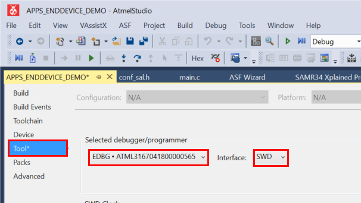
 
- Build and download the project by clicking the empty green "Run without debugging" triangle
 

 
- Open the Tera Term UART console previously configured at 115200 bps, 8-data bits/No parity/1-stop bit
 
- Press the "Reset" button on the SAM R34 Xplained Pro board to see output printed to the console
 
- Observe the following identifiers coming from the ATECC608A Secure Element
 
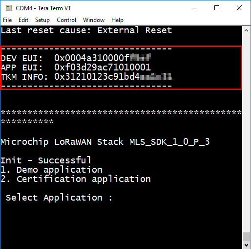
 

In order to pre-commission a device using ATECC608A secure element in ThingPark Activation, the following idenfiers are required:

DevEUI: LoRaWAN device 64-bit unique identifier assigned by the Device manufacturer (or using Secure Element default value)
JoinEUI: LoRaWAN JS 64-bit unique identifier of the Join Server on which AppKey of the device is stored
TKM Info: ATECC608A secure element identifier allowing ThingPark Activation to retrieve secure element AppKey

## Actility ThingPark Activation 

Activating the device within Actility ThingPark is the next step. 

Go here: <a href="https://github.com/actility/Microchip-Getting-Started" target="_blank">https://github.com/actility/Microchip-Getting-Started</a>

This guide will direct you through the process of getting started with developing a secure LoRa end device product using Microchip Technology's Pre-provisioned ATECC608A secure element along with ThingPark Activation service from Actility.

## Running the demo 

- Go back to the Tera Term UART console
 
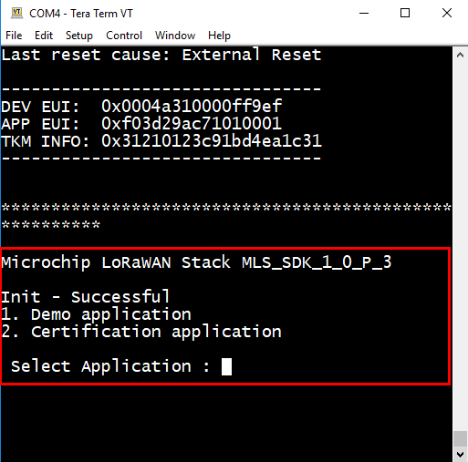
 
- Press "1" to start the Demo Application
 
- Select the band where your device is operating
 
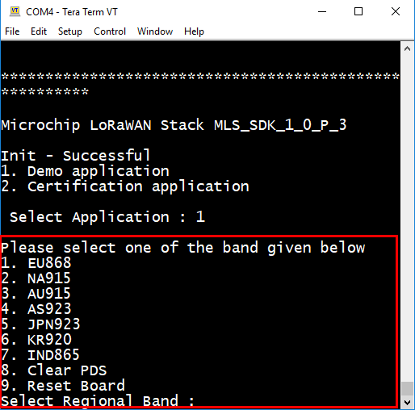
 
- Then, the end device application transmits a Join Request message. If a Join Accept message was received and validated, the SAM R34 Xplained Pro board will be joined to the Join Server.
 
- Press "2" to send a packet consisting of a temperature sensor reading
 
